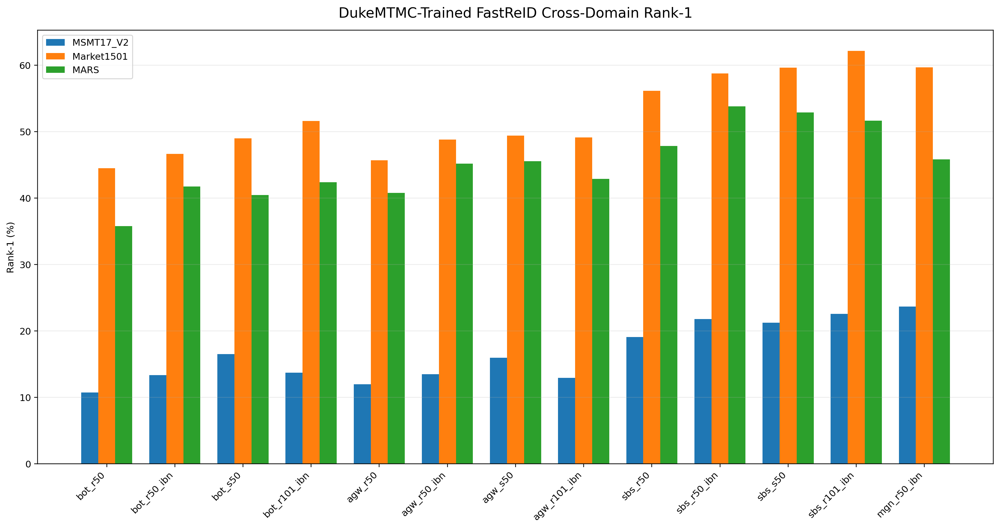
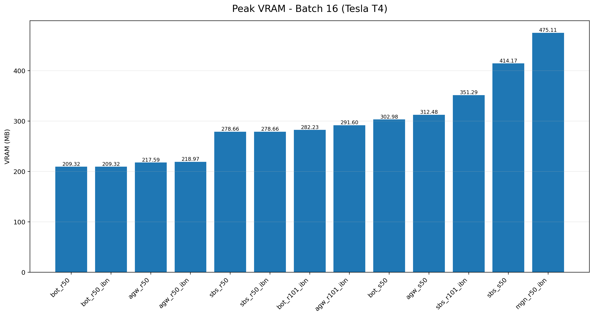

# SHAWAF FastReID DukeMTMC Benchmark

Cross-domain Person Re-Identification benchmark for **DukeMTMC-trained FastReID models** used in the SHAWAF ReID evaluation pipeline.

The benchmark evaluates **13 pretrained models** across three unseen datasets:

- **MSMT17_V2** — image-based ReID
- **Market1501** — image-based ReID
- **MARS** — tracklet/video-based ReID

No target-dataset fine-tuning, re-ranking, query expansion, quality filtering, or test-time adaptation is used.

---

## Benchmark Scope

### Models

The benchmark includes:

- **BoT**: R50, R50-IBN, S50, R101-IBN
- **AGW**: R50, R50-IBN, S50, R101-IBN
- **SBS**: R50, R50-IBN, S50, R101-IBN
- **MGN**: R50-IBN

Total:

```text
13 models × 3 datasets = 39 accuracy evaluations
```

### Evaluation Protocols

| Dataset | Type | Protocol |
|---|---|---|
| MSMT17_V2 | Image-based | `single_image_l2` |
| Market1501 | Image-based | `single_image_l2` |
| MARS | Tracklet-based | `uniform8_mean_raw_l2` |

For MARS:

```text
8 uniformly sampled frames
→ raw frame embeddings
→ mean pooling
→ final L2 normalization
→ cosine similarity
```

---

## Final Results

| Model | MSMT R1 | Market R1 | MARS R1 | Market mAP | MARS mAP | B1 Latency | Throughput | Peak VRAM B16 |
|---|---:|---:|---:|---:|---:|---:|---:|---:|
| BoT-R50 | 10.71% | 44.48% | 35.76% | 19.29% | 21.79% | 8.52 ms | 472.77 img/s | 209.32 MB |
| BoT-R50-IBN | 13.35% | 46.62% | 41.74% | 21.47% | 25.73% | 12.53 ms | 447.87 img/s | 209.32 MB |
| AGW-R50-IBN | 13.48% | 48.81% | 45.16% | 23.52% | 28.92% | 15.64 ms | 401.60 img/s | 218.97 MB |
| SBS-R50 | 19.09% | 56.12% | 47.83% | 26.47% | 30.67% | 11.79 ms | 280.24 img/s | 278.66 MB |
| SBS-R50-IBN | 21.78% | 58.76% | **53.80%** | 28.71% | **36.25%** | 14.66 ms | 269.81 img/s | 278.66 MB |
| SBS-S50 | 21.23% | 59.62% | 52.88% | 28.94% | 35.28% | 21.74 ms | 189.80 img/s | 414.17 MB |
| SBS-R101-IBN | 22.54% | **62.14%** | 51.63% | **31.48%** | 34.36% | 32.33 ms | 173.96 img/s | 351.29 MB |
| MGN-R50-IBN | **23.64%** | 59.65% | 45.82% | 26.31% | 26.44% | 26.02 ms | 148.14 img/s | 475.11 MB |

Full results:

```text
benchmarks/results/final_benchmark_summary.csv
benchmarks/results/final_benchmark_summary.md
```

---

## Key Figures

### Cross-Domain Rank-1 Overview



### Market1501 Rank-1 vs Latency


### MARS Rank-1 vs Tracklet Latency


### Peak VRAM at Batch 16



### MARS CMC Curves


---

## Efficiency Benchmark

Efficiency profiling hardware:

```text
GPU          : Tesla T4
GPU VRAM     : 14.56 GB
Python       : 3.12.11
PyTorch      : 2.8.0+cu128
CUDA runtime : 12.8
```

Protocol:

```text
Warm-up iterations      : 10
Measurement iterations  : 50
Throughput batch size    : 16
Tracklet frames          : 8
```

Measured metrics:

- Batch-1 latency
- Batch-16 latency
- Throughput
- 8-frame tracklet latency
- Baseline VRAM
- Peak VRAM at batch 1
- Peak VRAM at batch 16
- Parameter count
- Checkpoint size

> Efficiency results should only be compared directly with runs measured on the same hardware.

---

## Generated Outputs

```text
benchmarks/
├── embeddings/
├── figures/
│   ├── msmt17_rank1.png
│   ├── msmt17_map.png
│   ├── msmt17_cmc.png
│   ├── market1501_rank1.png
│   ├── market1501_map.png
│   ├── market1501_cmc.png
│   ├── mars_rank1.png
│   ├── mars_map.png
│   ├── mars_cmc.png
│   ├── batch1_latency.png
│   ├── tracklet_latency.png
│   ├── peak_vram_batch16.png
│   ├── throughput.png
│   ├── parameters.png
│   ├── market_rank1_vs_latency.png
│   ├── market_rank1_vs_vram.png
│   ├── market_map_vs_throughput.png
│   ├── mars_rank1_vs_tracklet_latency.png
│   ├── mars_rank1_vs_vram.png
│   ├── msmt_rank1_vs_latency.png
│   └── rank1_cross_domain.png
└── results/
    ├── cross_domain_summary.csv
    ├── cross_domain_summary.md
    ├── fastreid_efficiency.csv
    ├── final_benchmark_summary.csv
    ├── final_benchmark_summary.md
    └── cmc/
```

---

## Main Commands

```bash
python scripts/run_cross_domain_benchmark.py
python scripts/summarize_benchmark_results.py
python scripts/profile_fastreid_models.py
python scripts/build_final_benchmark_summary.py
python scripts/generate_cmc_curves.py
python scripts/generate_benchmark_figures.py
```

---

## Notes

- All checkpoints were trained on **DukeMTMC**.
- MSMT17_V2, Market1501, and MARS are evaluated as cross-domain datasets.
- One unreadable MSMT17_V2 query image and one unreadable gallery image were skipped.
- MARS uses exactly 8 uniformly sampled frames per tracklet.
- No target-domain fine-tuning or post-processing optimization is applied in the baseline benchmark.
