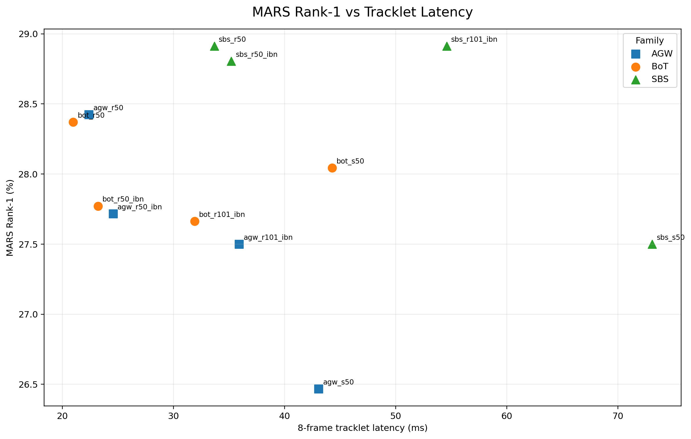
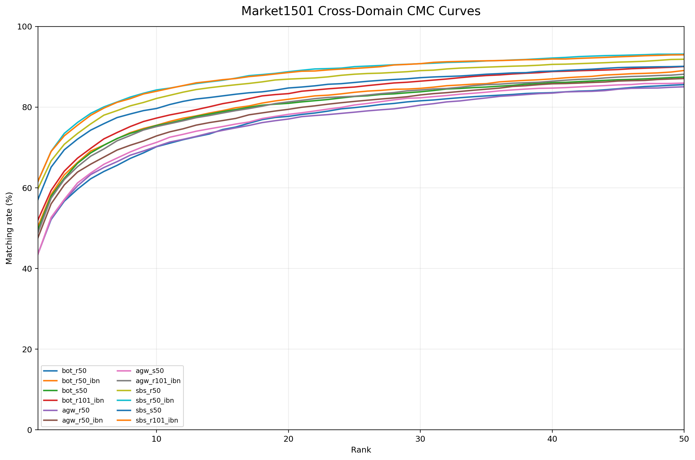
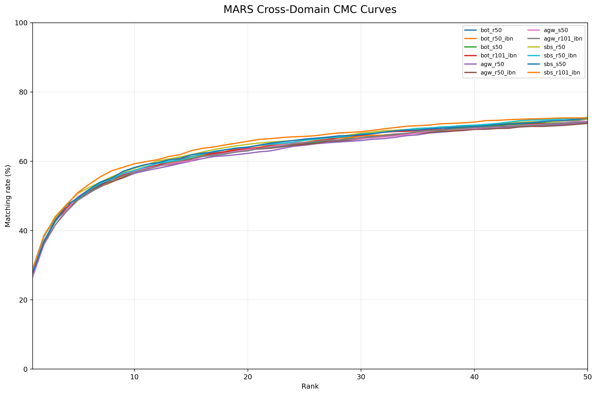

# SHAWAF Person Re-Identification Benchmark

Benchmarking framework for the **Person Re-Identification (ReID)** component of the SHAWAF graduation project.

SHAWAF is an intelligent CCTV video-search system. The ReID module receives person tracklets from the Detection + Tracking pipeline, extracts appearance embeddings, and matches the same person across different cameras.

This repository currently benchmarks **12 FastReID configurations** on **Market1501** and **MARS**, measuring both retrieval accuracy and inference efficiency.

---

## Benchmark Objective

The goal is not only to find the model with the highest accuracy.

For SHAWAF, the selected ReID model should provide a good balance between:

- retrieval accuracy,
- cross-domain generalization,
- inference latency,
- throughput,
- GPU memory usage,
- model complexity.

So the benchmark evaluates:

```text
Accuracy + Efficiency
```

and uses both when selecting the final deployment candidate.

---

## Evaluated Models

The benchmark covers three FastReID recipe families:

- **BoT**
- **AGW**
- **SBS**

Each family is tested with four backbone variants:

| Family | Backbones                   |
| ------ | --------------------------- |
| BoT    | R50, R50-IBN, S50, R101-IBN |
| AGW    | R50, R50-IBN, S50, R101-IBN |
| SBS    | R50, R50-IBN, S50, R101-IBN |

Total:

```text
3 families × 4 backbones = 12 models
```

All evaluated checkpoints are MSMT17-trained FastReID checkpoints.

---

## Datasets

### Market1501

Market1501 is evaluated using standard single-image ReID.

Validated benchmark splits:

| Split   | Samples |
| ------- | ------: |
| Train   |  12,936 |
| Query   |   3,368 |
| Gallery |  15,913 |

Protocol:

```text
Image
  ↓
FastReID model
  ↓
2048-D embedding
  ↓
L2 normalization
  ↓
Cosine similarity
  ↓
Gallery ranking
```

Cache protocol name:

```text
single_image_l2
```

### MARS

MARS is a video-based person ReID dataset containing person tracklets.

Validated benchmark splits:

| Split   | Tracklets |
| ------- | --------: |
| Train   |     8,298 |
| Query   |     1,980 |
| Gallery |     9,330 |

To evaluate image-based FastReID models on MARS, SHAWAF uses a fixed tracklet protocol:

```text
Tracklet
  ↓
Uniformly sample 8 frames
  ↓
Extract raw embedding for each frame
  ↓
Mean pooling
  ↓
Final L2 normalization
  ↓
Tracklet embedding
  ↓
Cosine similarity retrieval
```

The 8 frames are sampled uniformly across the tracklet.

For example, a 40-frame tracklet produces approximately:

```text
1, 7, 12, 18, 23, 29, 34, 40
```

Cache protocol name:

```text
uniform8_mean_raw_l2
```

This is the **SHAWAF benchmark protocol for applying image-based ReID models to MARS tracklets**.

---

## Benchmark Pipeline

```text
Official FastReID checkpoint
          ↓
Load model architecture + configuration
          ↓
Load query and gallery data
          ↓
Preprocess images / sample tracklet frames
          ↓
Extract embeddings
          ↓
Cache embeddings
          ↓
Cosine similarity
          ↓
Remove same-PID + same-camera matches
          ↓
Rank gallery
          ↓
Rank-1 / Rank-5 / Rank-10
mAP / mINP / CMC
          ↓
Efficiency profiling
          ↓
Accuracy + efficiency comparison
          ↓
Final deployment candidate
```

Embeddings are cached under:

```text
benchmarks/embeddings/
```

This avoids repeating expensive model inference when evaluation or visualization code changes.

---

## Evaluation Metrics

The benchmark reports:

| Metric      | Meaning                                                   |
| ----------- | --------------------------------------------------------- |
| **Rank-1**  | Correct identity appears as the first result              |
| **Rank-5**  | Correct identity appears within the first 5 results       |
| **Rank-10** | Correct identity appears within the first 10 results      |
| **mAP**     | Quality of ranking all relevant matches                   |
| **mINP**    | Difficulty of recovering the hardest relevant positive    |
| **CMC**     | Probability of finding the correct identity within Rank-K |

For MARS:

```text
Total queries   : 1,980
Valid queries   : 1,840
Skipped queries : 140
```

Queries are skipped when no valid positive remains after standard same-camera filtering.

---

## Cross-Domain Accuracy Results

All current checkpoints were trained on MSMT17 and evaluated without fine-tuning on Market1501 and MARS.

### Final Accuracy + Efficiency Table

| Model          |  Market R1 | Market mAP |    MARS R1 |   MARS mAP |     Latency |       Throughput | Peak VRAM B16 | Params |
| -------------- | ---------: | ---------: | ---------: | ---------: | ----------: | ---------------: | ------------: | -----: |
| `sbs_r101_ibn` | **61.61%** | **32.82%** | **28.91%** |     24.04% |    19.49 ms |     149.51 img/s |     351.29 MB | 42.58M |
| `sbs_r50_ibn`  |     61.55% |     32.05% |     28.80% |     24.04% |     9.07 ms |     232.88 img/s |     278.66 MB | 23.54M |
| `sbs_r50`      |     59.74% |     30.48% | **28.91%** | **24.19%** | **6.02 ms** |     244.15 img/s |     278.66 MB | 23.54M |
| `sbs_s50`      |     57.10% |     29.19% |     27.50% |     23.66% |    13.35 ms |     124.39 img/s |     345.94 MB | 25.44M |
| `bot_r101_ibn` |     52.02% |     26.49% |     27.66% |     23.42% |    23.28 ms |     262.19 img/s |     282.23 MB | 42.50M |
| `bot_r50_ibn`  |     50.42% |     26.22% |     27.77% |     23.48% |    11.77 ms |     402.47 img/s |     209.32 MB | 23.51M |
| `bot_s50`      |     49.64% |     24.79% |     28.04% |     23.43% |    16.51 ms |     185.93 img/s |     256.75 MB | 25.44M |
| `agw_r101_ibn` |     48.87% |     24.11% |     27.50% |     23.31% |    20.11 ms |     231.07 img/s |     291.60 MB | 42.58M |
| `agw_r50_ibn`  |     47.62% |     23.93% |     27.72% |     23.28% |    10.16 ms |     358.58 img/s |     218.97 MB | 23.54M |
| `bot_r50`      |     43.68% |     20.96% |     28.37% |     23.29% |     9.34 ms | **428.51 img/s** | **209.32 MB** | 23.51M |
| `agw_s50`      |     43.56% |     19.82% |     26.47% |     23.00% |    15.03 ms |     187.27 img/s |     266.25 MB | 25.44M |
| `agw_r50`      |     43.53% |     21.61% |     28.42% |     23.25% |     6.40 ms |     379.51 img/s |     217.59 MB | 23.54M |

The complete machine-readable result is available at:

```text
benchmarks/results/final_benchmark_summary.csv
```

---

## Efficiency Profiling

All 12 models were profiled under the same settings.

Reported environment:

```text
GPU                    : NVIDIA GeForce RTX 3050 Ti Laptop GPU
Warm-up iterations     : 10
Measurement iterations : 50
Throughput batch       : 16
Tracklet frames        : 8
```

Measured properties include:

- Batch-1 latency,
- Batch-16 latency,
- images per second,
- 8-frame tracklet latency,
- peak GPU memory,
- parameter count,
- checkpoint size.

The efficiency results are stored in:

```text
benchmarks/results/fastreid_efficiency.csv
```

---

# Key Visualizations

The benchmark automatically generates plots under:

```text
benchmarks/figures/
```

Below are the most important figures.

## Market1501 Rank-1


The SBS family clearly provides the strongest Market1501 cross-domain Rank-1 performance.

---

## MARS Rank-1


MARS results are much closer across the 12 models than Market1501 results.

---

## Market1501 Rank-1 vs Inference Latency


This figure shows the accuracy/latency trade-off.

The highest-accuracy model is not necessarily the best deployment model when inference cost is considered.

---

## MARS Rank-1 vs Tracklet Latency



This visualization is particularly relevant to SHAWAF because the system operates on person tracklets rather than isolated images.

---

## Market1501 CMC



The CMC curve shows retrieval performance from Rank-1 to Rank-50 instead of looking only at three fixed ranks.

---

## MARS CMC



For MARS, the CMC curve illustrates how frequently the correct person appears as the allowed retrieval depth increases.

---

## Final Model Selection

### Selected FastReID candidate: `sbs_r50`

`SBS R50` is currently selected as the primary FastReID deployment candidate for SHAWAF.

It does not have the highest Market1501 Rank-1 score, but it provides the strongest overall balance between accuracy and computational efficiency.

### SBS R50

```text
Market1501 Rank-1 : 59.74%
Market1501 mAP    : 30.48%

MARS Rank-1       : 28.91%
MARS mAP          : 24.19%

Batch-1 latency   : 6.02 ms
Throughput        : 244.15 images/s
Peak VRAM B16     : 278.66 MB
Parameters        : 23.54M
```

### Why not simply use SBS R101-IBN?

`SBS R101-IBN` gives the highest Market1501 accuracy:

```text
Rank-1 = 61.61%
mAP    = 32.82%
```

However:

```text
SBS R101-IBN
Latency   : 19.49 ms
Params    : 42.58M
MARS R1   : 28.91%

SBS R50
Latency   : 6.02 ms
Params    : 23.54M
MARS R1   : 28.91%
```

So the deeper R101 model is more than three times slower in Batch-1 inference while providing only a modest Market1501 accuracy improvement and no Rank-1 improvement on MARS.

For the current SHAWAF use case, `sbs_r50` is therefore the stronger deployment trade-off.

This recommendation is specific to the current benchmark protocol and hardware. It is not a claim that SBS R50 is universally the best ReID model.

---

## Running the Benchmark

### Install the project

From the repository root:

```bash
pip install -e .
```

### Validate the model registry

```bash
python scripts/validate_model_registry.py
```

### Validate all FastReID models

```bash
python scripts/validate_all_fastreid_models.py
```

### Run the complete cross-domain benchmark

```bash
python scripts/run_cross_domain_benchmark.py
```

The runner automatically skips completed embedding caches and evaluation results.

### Build the accuracy summary

```bash
python scripts/summarize_benchmark_results.py
```

### Run efficiency profiling

```bash
python scripts/profile_fastreid_models.py
```

### Build the final combined summary

```bash
python scripts/build_final_benchmark_summary.py
```

### Generate benchmark figures

```bash
python scripts/generate_benchmark_figures.py
```

### Generate CMC curves

```bash
python scripts/generate_cmc_curves.py
```

---

## Main Output Files

```text
benchmarks/
├── embeddings/
│   └── <model>/<dataset>/<protocol>/
│       ├── query.npz
│       └── gallery.npz
│
├── results/
│   ├── cross_domain_summary.csv
│   ├── cross_domain_summary.md
│   ├── fastreid_efficiency.csv
│   ├── final_benchmark_summary.csv
│   ├── final_benchmark_summary.md
│   └── cmc/
│
└── figures/
    ├── market1501_rank1.png
    ├── market1501_map.png
    ├── mars_rank1.png
    ├── mars_map.png
    ├── batch1_latency.png
    ├── throughput.png
    ├── tracklet_latency.png
    ├── peak_vram_batch16.png
    ├── parameters.png
    ├── market_rank1_vs_latency.png
    ├── market_map_vs_throughput.png
    ├── mars_rank1_vs_tracklet_latency.png
    ├── market_rank1_vs_vram.png
    ├── market1501_cmc.png
    └── mars_cmc.png
```

---

## Repository Structure

```text
Shawaf-ReID-V2/
├── README.md
├── pyproject.toml
│
├── configs/
│   └── benchmark/
│       └── fastreid_msmt17_models.yaml
│
├── checkpoints/
│   └── fastreid/
│       └── msmt17/
│
├── data/
│   ├── Market-1501-v15.09.15/
│   ├── MSMT17/
│   └── mars/
│
├── reid/
│   ├── benchmark/
│   ├── data/
│   ├── embeddings/
│   ├── evaluation/
│   ├── models/
│   ├── profiling/
│   └── visualization/
│
├── scripts/
│   ├── run_cross_domain_benchmark.py
│   ├── build_embedding_cache.py
│   ├── evaluate_embedding_cache.py
│   ├── summarize_benchmark_results.py
│   ├── profile_fastreid_models.py
│   ├── build_final_benchmark_summary.py
│   ├── generate_benchmark_figures.py
│   └── generate_cmc_curves.py
│
├── benchmarks/
│   ├── embeddings/
│   ├── results/
│   └── figures/
│
└── third_party/
    └── fast-reid/
```

---

## Current Limitations

The current benchmark has several intentional limitations.

**MSMT17_V2 verification is pending.**  
The currently available local MSMT17 copy is not used as the final in-domain benchmark because its provenance/version has not been verified. Once a verified MSMT17_V2 copy is available, the same benchmark pipeline can be extended to include in-domain MSMT17 evaluation.

**MARS uses a fixed image-model tracklet protocol.**  
Eight frames are uniformly sampled and mean-pooled. This keeps the comparison fair across the 12 image-based FastReID models, but it is not a comparison against dedicated temporal video-ReID architectures.

**Efficiency results are hardware-specific.**  
Latency, throughput, and VRAM values depend on the GPU, CUDA/PyTorch environment, batch size, and profiling protocol.

**Qualitative retrieval visualization is currently skipped.**  
The current benchmark focuses on quantitative accuracy, efficiency, and CMC analysis.

---

## Next Steps

Planned extensions include:

- verified MSMT17_V2 in-domain evaluation,
- comparison with OSNet and additional ReID model families,
- evaluation of stronger cross-domain approaches,
- optional re-ranking experiments,
- large-scale vector search integration,
- deployment of the selected ReID encoder inside the SHAWAF retrieval pipeline.

---

## Current Status

```text
FastReID model integration        ✅
12-model compatibility validation ✅
Market1501 loader                 ✅
MARS loader                       ✅
Tracklet sampling                 ✅
Embedding extraction              ✅
Embedding caching                 ✅
Rank evaluation                   ✅
Cross-domain benchmark            ✅
Efficiency profiling              ✅
Accuracy/efficiency summary       ✅
Benchmark visualizations          ✅
CMC curves                        ✅
Qualitative retrieval             ⏭️ intentionally skipped
Final FastReID candidate          ✅ SBS R50
MSMT17_V2 final evaluation        ⏳ pending verified dataset access
```
