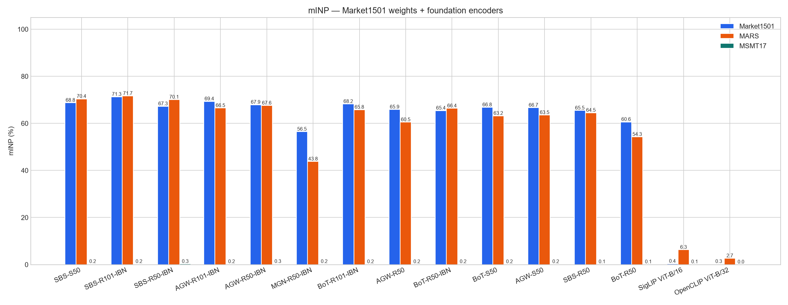

# SHAWAF Person Re-Identification

ReID module for the **SHAWAF graduation project**.

The ReID team receives **tracklets** from the Detection + Tracking team and converts each tracklet into an appearance representation that can later be used to match the same person across different cameras.

For the Tracklet interface, see:

```text
TRACKLET_CONTRACT.md
```

---

## Current Project Structure

```text
Person-ReID-BenchMark/
├── README.md
├── TRACKLET_CONTRACT.md
├── pyproject.toml
├── .gitignore
│
├── reid/
│   ├── sampling.py
│   ├── aggregate.py
│   ├── metrics.py
│   ├── profiling.py
│   ├── eval_loop.py
│   ├── models/
│   │   ├── fastreid.py      # FastReID YAML + zoo checkpoint
│   │   ├── foundation.py    # timm CLIP / SigLIP backends
│   │   ├── runtime.py       # shared batched extract
│   │   └── registry.py      # model catalog + factory
│   └── data/
│       ├── tracklet.py
│       ├── mars.py
│       ├── market1501.py
│       └── msmt17.py
│
├── docs/benchmark/          # plots, tables.md, committed metric JSON
└── scripts/
    ├── test_tracklet.py
    ├── eval_encoder.py
    ├── run_comparison.py
    ├── plot_comparison.py
    └── import_v2_results.py
```
---

# FastReID baseline

Two eval-only benchmarks share the same pretrained **SBS ResNet-50** checkpoint trained on Market1501 (no extra training):

1. Official FastReID image ReID on Market1501 (sanity check vs the model zoo).
2. SHAWAF tracklet ReID on MARS (sample frames, extract features, mean-pool, Rank-1 / mAP).

Use a **Python 3.11 CUDA** environment. FastReID does not import on the base Python 3.13 install. On this machine the working env is `crowd-gpu` (PyTorch 2.11 + CUDA 12.8). Install extras with:

```bash
conda activate crowd-gpu
python -m pip install -e ".[fastreid]"
```

Weights (gitignored): `weights/market_sbs_R50.pth`  
https://github.com/JDAI-CV/fast-reid/releases/download/v0.1.1/market_sbs_R50.pth

Zoo target on Market1501: **Rank-1 95.4% / mAP 88.2%**. Official FastReID CLI: **Rank-1 95.28% / mAP 88.48%**. SHAWAF wrapper: **95.16 / 88.46** (`results/comparison/sbs_r50_market1501.json`).

---

# Model comparison

Every encoder is frozen (no extra training). The same SHAWAF ranking is used everywhere: cosine on L2 features, same-pid + same-camera junk.

| Eval set | Protocol | Query / gallery | What it tests |
|---|---|---|---|
| **Market1501** | 1 crop / image | 3368 / 15913 | Classic image ReID |
| **MARS** | 8-frame mean-pool + L2 | 1980 / 9330 (1840 valid) | Tracklets, **same campus** as Market |
| **MSMT17 V1** | 1 crop / image | 11659 / 82161 | **Hard camera / scene shift** (15 cams, indoor+outdoor) |

MSMT17 V1 pixels are unblurred. FastReID’s MSMT zoo was trained on **V2** (blurred faces). Protocol matches; pixels do not.

Full CMC (Rank-1/5/10/20, mAP, mINP) lives in [`docs/benchmark/tables.md`](docs/benchmark/tables.md). JSON: `docs/benchmark/results/` and `results/comparison/`. GPU: RTX 5070 Laptop 8 GB, `crowd-gpu`.

There are **two train sets**. Do not mix them.

| Train set | In-domain eval | Cross-domain eval | Status |
|---|---|---|---|
| **Market1501 zoo** (+ CLIP/SigLIP baselines) | Market1501 | MARS (same campus) and MSMT17 V1 (hard) | **Measured here** |
| **MSMT17 zoo** | MSMT17 | Market1501 and MARS | Transfer **imported**; **in-domain MSMT17 V1 not run** |

---

## 1. Trained on Market1501 — in-domain + transfer

FastReID Market zoo (SBS / BoT / AGW / MGN) plus two frozen foundation encoders with **no ReID training**.

- **In-domain:** Market1501. ReID CNNs are 93–96 Rank-1. CLIP/SigLIP are not person-ID models.
- **Related transfer:** MARS. Same campus as Market, but video tracklets. CNNs stay high (~81–91 Rank-1).
- **Hard transfer:** MSMT17 V1. CNNs fall to ~7–21 Rank-1 / ~2–7 mAP. SigLIP leads this set on MSMT Rank-1 (**24.40**) despite being weak on Market.




CMC extras: [Rank-5](docs/benchmark/rank5.png) · [Rank-10](docs/benchmark/rank10.png) · [Rank-20](docs/benchmark/rank20.png)

| Model | Train | Market R1 | Market mAP | MARS R1 | MARS mAP | MSMT R1 | MSMT mAP |
|---|---|---:|---:|---:|---:|---:|---:|
| SBS-S50 | Market1501 | **96.11** | 89.67 | **90.54** | 87.03 | 19.70 | 6.80 |
| SBS-R101-IBN | Market1501 | 95.81 | **90.25** | 90.33 | **87.88** | 19.78 | 6.81 |
| SBS-R50-IBN | Market1501 | 95.55 | 89.13 | 89.18 | 86.64 | 20.79 | 7.10 |
| AGW-R101-IBN | Market1501 | 95.52 | 89.61 | 87.55 | 84.15 | 14.20 | 4.78 |
| AGW-R50-IBN | Market1501 | 95.52 | 89.09 | 87.55 | 84.47 | 14.52 | 5.14 |
| MGN-R50-IBN | Market1501 | 95.37 | 87.25 | 84.51 | 74.50 | 20.84 | **7.17** |
| BoT-R101-IBN | Market1501 | 95.34 | 89.12 | 86.79 | 83.83 | 13.29 | 4.47 |
| AGW-R50 | Market1501 | 95.31 | 88.49 | 85.71 | 80.67 | 10.84 | 3.61 |
| BoT-R50-IBN | Market1501 | 95.28 | 88.23 | 87.83 | 84.10 | 13.23 | 4.69 |
| BoT-S50 | Market1501 | 95.28 | 88.64 | 86.14 | 82.35 | 14.36 | 4.92 |
| AGW-S50 | Market1501 | 95.19 | 88.59 | 86.47 | 82.09 | 14.86 | 4.96 |
| SBS-R50 | Market1501 | 95.16 | 88.46 | 87.72 | 84.04 | 14.73 | 4.72 |
| BoT-R50 | Market1501 | 93.85 | 86.30 | 81.52 | 75.99 | 7.47 | 2.35 |
| SigLIP ViT-B/16 | WebLI | 20.58 | 6.51 | 38.97 | 21.49 | **24.40** | 6.33 |
| OpenCLIP ViT-B/32 | LAION-2B | 13.15 | 4.06 | 21.52 | 11.03 | 4.74 | 1.02 |

Market CMC Rank-1/5/10/20: SBS-S50 **96.11 / 98.69 / 99.14 / 99.41**; SBS-R101-IBN **95.81 / 98.75 / 99.20 / 99.55**.

### Compute (Market1501 extract, CUDA-event GPU time)


| Model | Params (M) | Weights (MiB) | Allocated (MiB) | Peak (MiB) | GPU ms/img | GPU img/s |
|---|---:|---:|---:|---:|---:|---:|
| BoT-R50 | 23.5 | 89.9 | 89.9 | **310** | **1.50** | **666** |
| AGW-R50 | 23.5 | 90.0 | 90.1 | 318 | 1.54 | 651 |
| BoT-R50-IBN | 23.5 | 89.9 | 90.0 | 310 | 1.58 | 632 |
| OpenCLIP ViT-B/32 | 87.5 | 334 | 334 | 436 | 1.71 | 584 |
| AGW-R50-IBN | 23.5 | 90.0 | 90.1 | 318 | 1.73 | 576 |
| BoT-S50 | 25.4 | 97.3 | 97.3 | 397 | 2.14 | 468 |
| AGW-S50 | 25.4 | 97.3 | 97.3 | 397 | 2.16 | 463 |
| AGW-R101-IBN | 42.6 | 163 | 163 | 391 | 2.39 | 418 |
| BoT-R101-IBN | 42.5 | 163 | 163 | 383 | 2.40 | 417 |
| SBS-R50 | 23.5 | 90.0 | 90.1 | 428 | 2.54 | 394 |
| SBS-R50-IBN | 23.5 | 90.0 | 90.1 | 428 | 2.92 | 343 |
| SBS-R101-IBN | 42.6 | 163 | 163 | 501 | 3.69 | 271 |
| MGN-R50-IBN | 68.8 | 263 | 268 | 434 | 4.67 | 214 |
| SBS-S50 | 25.4 | 97.3 | 97.4 | **547** | 5.69 | 176 |
| SigLIP ViT-B/16 | 92.9 | 354 | 354 | 622 | 6.84 | 146 |

---

## 2. Trained on MSMT17 — transfer only (in-domain MSMT not measured)

FastReID MSMT zoo (`msmt_*.pth`), **no fine-tune**. Numbers imported from `feature/fastreid-benchmark-v2` after matching split sizes and CMC protocol. Rank-20 was not stored in that import.

- **In-domain MSMT17:** not in this bench. We have V1 on disk; the zoo was trained on V2; those weights were never extracted on our MSMT17 loader.
- **Cross-domain:** Market1501 (~44–62 Rank-1) and MARS (~26–29 Rank-1). Transfer to Market is much weaker than Market-trained in-domain (~95). Transfer to MARS is also weak — MARS is the same campus as Market, not MSMT.


CMC extras: [Rank-5](docs/benchmark/rank5_msmt.png) · [Rank-10](docs/benchmark/rank10_msmt.png) · [mINP](docs/benchmark/minp_msmt.png) · [CMC Market](docs/benchmark/cmc_msmt_market1501.png) · [CMC MARS](docs/benchmark/cmc_msmt_mars.png)

| Model | MSMT in-domain | Market R1 | Market mAP | MARS R1 | MARS mAP |
|---|---:|---:|---:|---:|---:|
| SBS-R101-IBN | — | **61.61** | **32.82** | **28.91** | 24.04 |
| SBS-R50-IBN | — | 61.55 | 32.05 | 28.80 | 24.04 |
| SBS-R50 | — | 59.74 | 30.48 | **28.91** | **24.19** |
| SBS-S50 | — | 57.10 | 29.19 | 27.50 | 23.66 |
| BoT-R101-IBN | — | 52.02 | 26.49 | 27.66 | 23.42 |
| BoT-R50-IBN | — | 50.42 | 26.22 | 27.77 | 23.48 |
| BoT-S50 | — | 49.64 | 24.79 | 28.04 | 23.43 |
| AGW-R101-IBN | — | 48.87 | 24.11 | 27.50 | 23.31 |
| AGW-R50-IBN | — | 47.62 | 23.93 | 27.72 | 23.28 |
| BoT-R50 | — | 43.68 | 20.96 | 28.37 | 23.29 |
| AGW-S50 | — | 43.56 | 19.82 | 26.47 | 23.00 |
| AGW-R50 | — | 43.53 | 21.61 | 28.42 | 23.25 |

---

## 3. Same recipe, different train set

SBS / AGW / BoT R50 trained on Market vs trained on MSMT, then evaluated on Market and on MARS. This is the head-to-head transfer plot.


On R50: Market train → Market eval ~95 Rank-1; MSMT train → Market eval ~44–60 Rank-1. MARS stays high only if the model was trained on Market (same campus).

Not in this bench on purpose: DukeMTMC zoo (dataset withdrawn), vehicle ReID, FastReID ViT (no zoo `.pth`), newer non-FastReID models (SOLIDER, CLIP-ReID).

## How to run

Activate `crowd-gpu` first. JSON is written to `results/comparison/{model}_{dataset}.json`.

`--dataset` is `market1501`, `mars`, or `msmt17`.

**Measured Market-trained keys:** `sbs_r50`, `sbs_r50_ibn`, `sbs_s50`, `sbs_r101_ibn`, `bot_r50`, `bot_r50_ibn`, `bot_s50`, `bot_r101_ibn`, `agw_r50`, `agw_r50_ibn`, `agw_s50`, `agw_r101_ibn`, `mgn_r50_ibn`, `siglip_base`, `openclip_vitb32`  
**Imported MSMT17-trained keys:** `msmt_sbs_r50`, `msmt_sbs_r50_ibn`, `msmt_sbs_s50`, `msmt_sbs_r101_ibn`, and the same pattern for `bot` / `agw`

### One model

```bash
conda activate crowd-gpu

python scripts/eval_encoder.py --model sbs_s50 --dataset market1501 --device cuda
python scripts/eval_encoder.py --model sbs_s50 --dataset mars --device cuda
python scripts/eval_encoder.py --model sbs_s50 --dataset msmt17 --device cuda
```

MSMT17-trained SBS-R50 (downloads `weights/msmt_sbs_R50.pth` if missing):

```bash
python scripts/eval_encoder.py --model msmt_sbs_r50 --dataset market1501 --device cuda
python scripts/eval_encoder.py --model msmt_sbs_r50 --dataset mars --device cuda
```

### Default sweep (all measured Market-trained + foundation models, three datasets)

```bash
conda activate crowd-gpu
python scripts/run_comparison.py --skip-existing --device cuda --batch-size 16
```

A subset:

```bash
python scripts/run_comparison.py --models sbs_r50 agw_r50 --datasets mars --device cuda
python scripts/run_comparison.py --models mgn_r50_ibn --datasets market1501 mars --device cuda --batch-size 16
```

Plots only (no extract):

```bash
python scripts/plot_comparison.py
```

Re-import teammate MSMT17 JSON/CMC into `docs/benchmark/results/`:

```bash
python scripts/import_v2_results.py
python scripts/plot_comparison.py
```

MARS only needs `bbox_test/` plus `info/` (`bbox_train/` can stay empty). Market-trained SBS-S50 on MARS: **Rank-1 90.54% / mAP 87.03%**. MARS and Market1501 share the same capture site, so that number is an in-scene tracklet baseline rather than a harsh domain shift.

## Official Market1501 eval

Put Market1501 under `datasets/Market-1501-v15.09.15/` (`bounding_box_train/`, `bounding_box_test/`, `query/`). From `fast-reid/`:

```bash
conda activate crowd-gpu
$env:FASTREID_DATASETS = "$PWD\..\datasets"

python tools/train_net.py --config-file ./configs/Market1501/sbs_R50.yml --eval-only `
  MODEL.WEIGHTS "$PWD\..\weights\market_sbs_R50.pth" `
  MODEL.DEVICE "cuda:0" `
  MODEL.BACKBONE.PRETRAIN False `
  DATALOADER.NUM_WORKERS 0 `
  TEST.IMS_PER_BATCH 32
```

On Windows, `DATALOADER.NUM_WORKERS 0` avoids DataLoader hangs. Cython rank eval is skipped if `make` is missing; Python CMC/mAP is used instead.

---

# MSMT17 Dataset

MSMT17 is the large multi-camera image ReID set (15 cameras, indoor + outdoor). This bench uses **V1** (`train/` + `test/` + `list_query.txt` / `list_gallery.txt`). V2 is the same splits with blurred faces (`mask_train_v2/` / `mask_test_v2`).

Place it at:

```text
datasets/MSMT17_V1/
├── train/
├── test/
├── list_query.txt
├── list_gallery.txt
└── list_train.txt
```

Public V1 zip: https://huggingface.co/datasets/xianpeijie/MSMT17_V1/resolve/main/MSMT17_V1.zip  
Official V2 (login): PKU SharePoint `MSMT17_V2.zip`.

`datasets/` is gitignored.

---

# MARS Dataset

We use **MARS** because it is a video Person Re-Identification dataset based on **tracklets**, which matches the type of input our SHAWAF ReID system will receive from the Detection + Tracking team.

The dataset is not uploaded to GitHub because of its large size.

---

## Required Dataset Structure

Create a local `datasets` folder with this structure:

```text
datasets/
├── Market-1501-v15.09.15/
├── MSMT17_V1/
└── MARS/
    ├── bbox_train/
    ├── bbox_test/
    └── info/
```

So the complete local project will look like:

```text
Person-ReID-BenchMark/
├── reid/
├── scripts/
├── datasets/
│   └── MARS/
│       ├── bbox_train/
│       ├── bbox_test/
│       └── info/
├── TRACKLET_CONTRACT.md
├── pyproject.toml
├── .gitignore
└── README.md
```

`datasets/` is ignored by Git and should **not** be pushed to GitHub.

---

## Download `bbox_train` and `bbox_test`

Download the MARS dataset from Google Drive:

https://drive.google.com/open?id=1m6yLgtQdhb6pLCcb6_m7sj0LLBRvkDW0

After downloading, extract:

```text
bbox_train.zip
bbox_test.zip
```

and place them here:

```text
datasets/MARS/bbox_train/
datasets/MARS/bbox_test/
```

---

## Download `info`

The MARS metadata is available here:

https://github.com/liangzheng06/MARS-evaluation/tree/master/info

The `info` folder should contain:

```text
info/
├── query_IDX.mat
├── test_name.txt
├── tracks_test_info.mat
├── tracks_train_info.mat
└── train_name.txt
```

To download only the `info` folder using Git:

```bash
git clone --filter=blob:none --no-checkout https://github.com/liangzheng06/MARS-evaluation.git

cd MARS-evaluation

git sparse-checkout init --cone

git sparse-checkout set info

git checkout master
```

If Google Drive / SharePoint is blocked, the same bbox trees are on Kaggle (`lyqassf/marslyq`). With a Python 3.11 env:

```bash
python -c "import kagglehub; print(kagglehub.dataset_download('lyqassf/marslyq'))"
```

Copy the resulting `bbox_train/` and `bbox_test/` into `datasets/MARS/` next to `info/`.

---

# Installation

From the project root:

```bash
python -m pip install -e .
```

This installs the SHAWAF ReID package and its required dependencies in editable mode.

---

# Current Goal

```text
MARS Dataset
      ↓
MARS Loader
      ↓
SHAWAF Tracklet Objects
      ↓
Preprocessing
      ↓
ReID Encoder
      ↓
Tracklet Embedding
      ↓
Matching / Retrieval
```