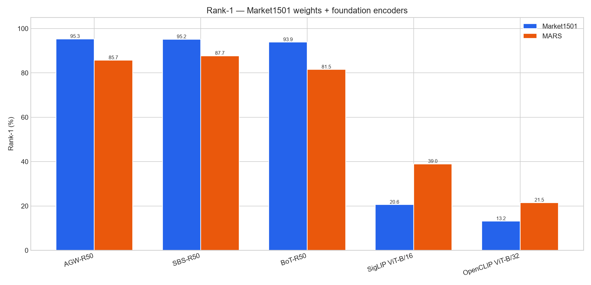
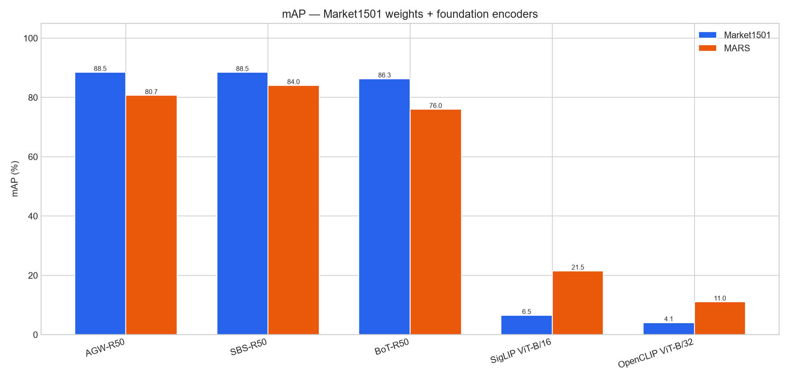
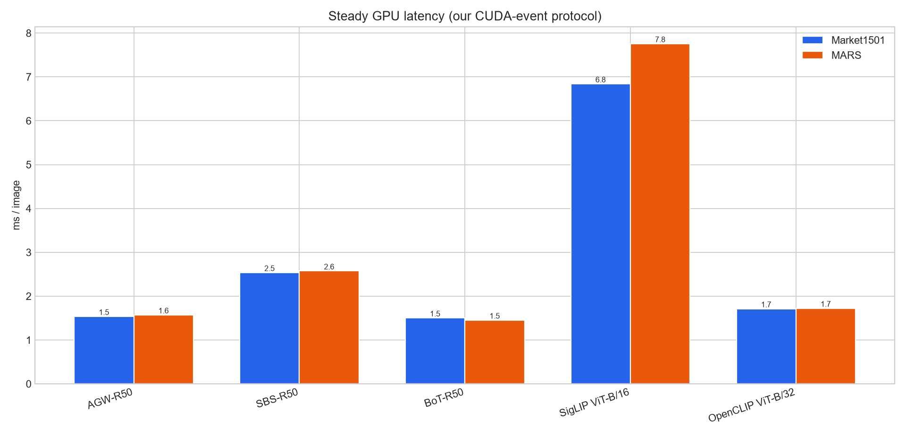
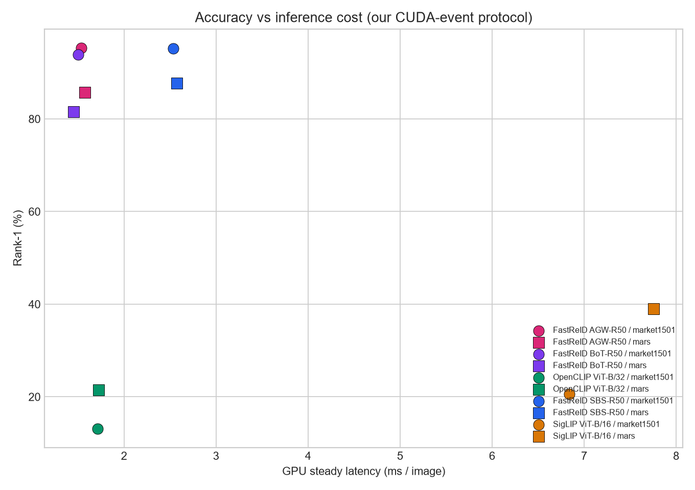
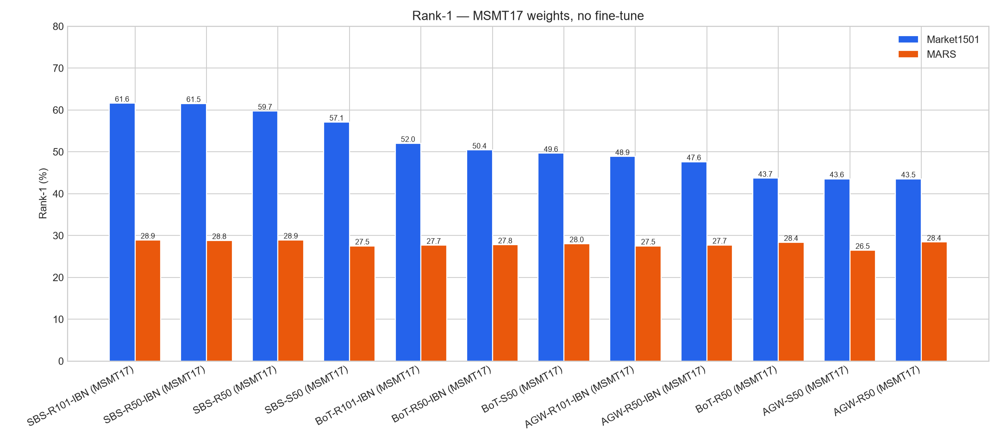
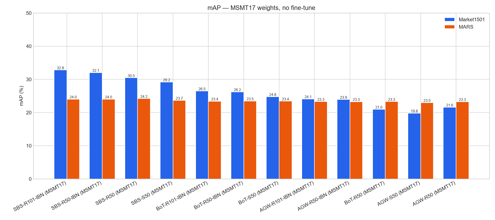
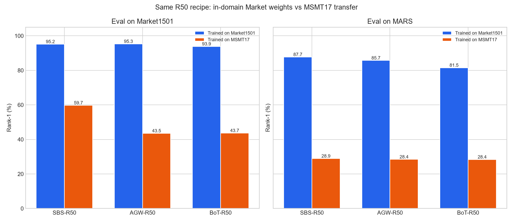
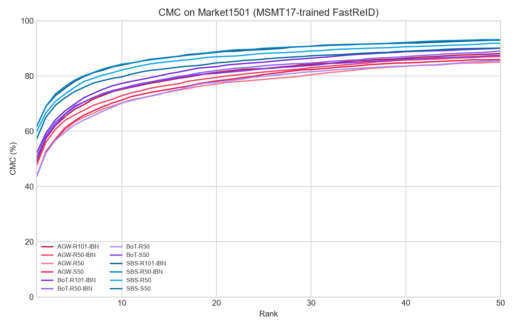
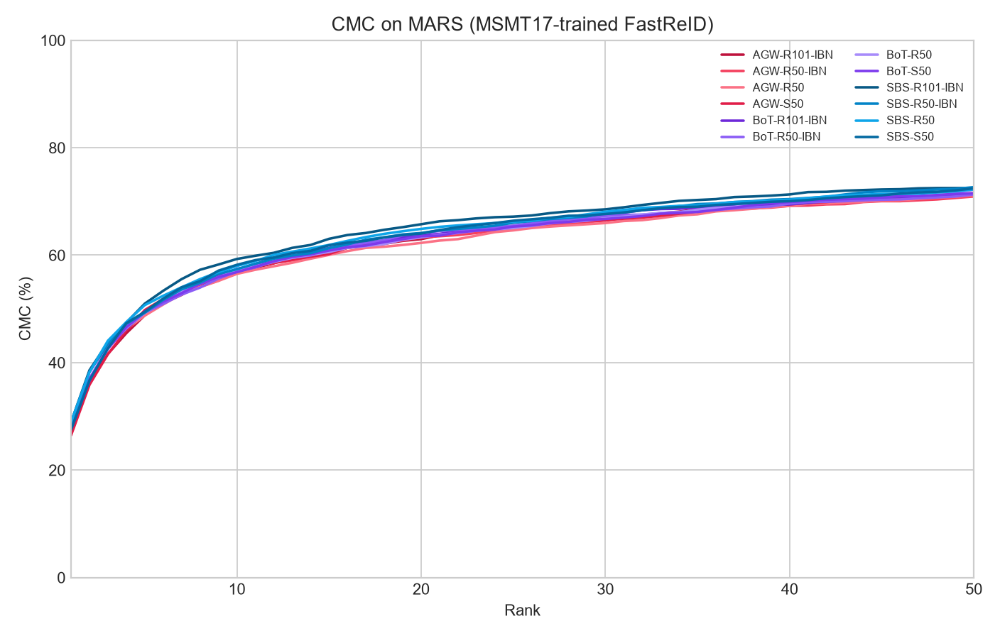

# SHAWAF Person Re-Identification

ReID module for the **SHAWAF graduation project**.

The ReID team receives **tracklets** from the Detection + Tracking team and converts each tracklet into an appearance representation that can later be used to match the same person across different cameras.

For the Tracklet interface, see:

```text
TRACKLET_CONTRACT.md
```

---

## Current Project Structure

```text
Person-ReID-BenchMark/
├── README.md
├── TRACKLET_CONTRACT.md
├── pyproject.toml
├── .gitignore
│
├── reid/
│   ├── sampling.py
│   ├── aggregate.py
│   ├── metrics.py
│   ├── profiling.py
│   ├── eval_loop.py
│   ├── models/
│   │   ├── fastreid.py      # FastReID YAML + zoo checkpoint
│   │   ├── foundation.py    # timm CLIP / SigLIP backends
│   │   ├── runtime.py       # shared batched extract
│   │   └── registry.py      # model catalog + factory
│   └── data/
│       ├── tracklet.py
│       ├── mars.py
│       └── market1501.py
│
├── docs/benchmark/          # plots + committed metric JSON
└── scripts/
    ├── test_tracklet.py
    ├── inspect_mars.py
    ├── eval_encoder.py
    ├── run_comparison.py
    ├── plot_comparison.py
    └── import_v2_results.py
```
---

# FastReID baseline

Two eval-only benchmarks share the same pretrained **SBS ResNet-50** checkpoint trained on Market1501 (no extra training):

1. Official FastReID image ReID on Market1501 (sanity check vs the model zoo).
2. SHAWAF tracklet ReID on MARS (sample frames, extract features, mean-pool, Rank-1 / mAP).

Use a **Python 3.11 CUDA** environment. FastReID does not import on the base Python 3.13 install. On this machine the working env is `crowd-gpu` (PyTorch 2.11 + CUDA 12.8). Install extras with:

```bash
conda activate crowd-gpu
python -m pip install -e ".[fastreid]"
```

Weights (gitignored): `weights/market_sbs_R50.pth`  
https://github.com/JDAI-CV/fast-reid/releases/download/v0.1.1/market_sbs_R50.pth

Zoo target on Market1501: **Rank-1 95.4% / mAP 88.2%**. Official FastReID CLI: **Rank-1 95.28% / mAP 88.48%**. SHAWAF wrapper: **95.16 / 88.46** (`results/comparison/sbs_r50_market1501.json`).

---

# Model comparison

Same **eval protocol** for every encoder, no extra training on Market1501/MARS:

- **Market1501:** one crop per query/gallery image (official image ReID)
- **MARS:** 8-frame uniform sample → embed → mean-pool + L2 → cosine Rank-1 / mAP
- Query/gallery counts: Market1501 3368 / 15913; MARS 1980 / 9330 (1840 valid queries)
- RTX 5070 Laptop (8 GB), `crowd-gpu`

Two **training sets** are reported separately. Do not mix the tables: Market1501-trained R50 is in-domain (and MARS is the same campus). MSMT17-trained weights are a cross-domain transfer test, which is closer to “will this work on SHAWAF cameras.”

JSON snapshots live in `docs/benchmark/results/` (committed) and `results/comparison/` (local overlay).

## In-domain (Market1501 weights + foundation)

ReID-trained CNNs stay in the 80–95% Rank-1 range. Frozen OpenCLIP / SigLIP are much weaker — they were never trained to tell people apart.










| Model | Trained on | Market1501 Rank-1 | Market1501 mAP | MARS Rank-1 | MARS mAP |
|---|---|---:|---:|---:|---:|
| FastReID AGW-R50 | Market1501 | **95.31** | **88.49** | 85.71 | 80.67 |
| FastReID SBS-R50 | Market1501 | 95.16 | 88.46 | **87.72** | **84.04** |
| FastReID BoT-R50 | Market1501 | 93.85 | 86.30 | 81.52 | 75.99 |
| SigLIP ViT-B/16 | WebLI | 20.58 | 6.51 | 38.97 | 21.49 |
| OpenCLIP ViT-B/32 | LAION-2B | 13.15 | 4.06 | 21.52 | 11.03 |

### Compute (Market1501 extract, CUDA-event GPU time, batch 32)

| Model | Params (M) | Weights (MiB) | Allocated (MiB) | Peak (MiB) | GPU ms/img | GPU img/s |
|---|---:|---:|---:|---:|---:|---:|
| FastReID BoT-R50 | 23.5 | 89.9 | 89.9 | **310** | **1.50** | **666** |
| FastReID AGW-R50 | 23.5 | 90.0 | 90.1 | 318 | 1.54 | 651 |
| FastReID SBS-R50 | 23.5 | 90.0 | 90.1 | 428 | 2.54 | 394 |
| OpenCLIP ViT-B/32 | 87.5 | 334 | 334 | 436 | 1.71 | 584 |
| SigLIP ViT-B/16 | 92.9 | 354 | 354 | 622 | 6.84 | 146 |

## Cross-domain (MSMT17 weights, no fine-tune)

Same Market1501 / MARS loaders and ranking. Checkpoints are the FastReID MSMT17 zoo (`msmt_*.pth`). Numbers imported from `feature/fastreid-benchmark-v2` after confirming split sizes and CMC protocol match.











| Model | Market1501 Rank-1 | Market1501 mAP | MARS Rank-1 | MARS mAP |
|---|---:|---:|---:|---:|
| SBS-R101-IBN | **61.61** | **32.82** | **28.91** | 24.04 |
| SBS-R50-IBN | 61.55 | 32.05 | 28.80 | 24.04 |
| SBS-R50 | 59.74 | 30.48 | **28.91** | **24.19** |
| SBS-S50 | 57.10 | 29.19 | 27.50 | 23.66 |
| BoT-R101-IBN | 52.02 | 26.49 | 27.66 | 23.42 |
| BoT-R50-IBN | 50.42 | 26.22 | 27.77 | 23.48 |
| BoT-S50 | 49.64 | 24.79 | 28.04 | 23.43 |
| AGW-R101-IBN | 48.87 | 24.11 | 27.50 | 23.31 |
| AGW-R50-IBN | 47.62 | 23.93 | 27.72 | 23.28 |
| BoT-R50 | 43.68 | 20.96 | 28.37 | 23.29 |
| AGW-S50 | 43.56 | 19.82 | 26.47 | 23.00 |
| AGW-R50 | 43.53 | 21.61 | 28.42 | 23.25 |

On the shared R50 recipes, Market1501 training → Market eval is ~95 Rank-1; MSMT17 training → Market eval is ~44–60 Rank-1. MARS stays high only for Market-trained models (same campus).

## FastReID zoo still left

Registered in `reid/models/registry.py` and runnable with `eval_encoder.py`, but **not extracted yet** on this protocol:

| Key | Model | Notes |
|---|---|---|
| `sbs_r50_ibn` / `sbs_s50` / `sbs_r101_ibn` | SBS Market zoo | Best in-domain headroom in the official zoo |
| `bot_r50_ibn` / `bot_s50` / `bot_r101_ibn` | BoT Market zoo | |
| `agw_r50_ibn` / `agw_s50` / `agw_r101_ibn` | AGW Market zoo | |
| `mgn_r50_ibn` | MGN-R50-IBN | Heavier; ~806 MB checkpoint |

Not in this bench on purpose:

- DukeMTMC zoo (dataset withdrawn)
- Vehicle ReID (VeRi / VehicleID / VERI-Wild)
- FastReID ViT (`bagtricks_vit.yml`) — no zoo `.pth`
- MSMT17 **in-domain** eval (dataset copy not verified)
- Newer non-FastReID models (SOLIDER, CLIP-ReID)

## How to run

Activate `crowd-gpu` first. JSON is written to `results/comparison/{model}_{dataset}.json`.

`--dataset` is `market1501` or `mars`.

**Measured in-domain keys:** `sbs_r50`, `agw_r50`, `bot_r50`, `siglip_base`, `openclip_vitb32`  
**Imported MSMT17 keys:** `msmt_sbs_r50`, `msmt_sbs_r50_ibn`, `msmt_sbs_s50`, `msmt_sbs_r101_ibn`, and the same pattern for `bot` / `agw`  
**Registered, not run yet:** `sbs_r50_ibn`, `sbs_s50`, `sbs_r101_ibn`, `mgn_r50_ibn`, …

### One model

```bash
conda activate crowd-gpu

python scripts/eval_encoder.py --model sbs_r50 --dataset market1501 --device cuda
python scripts/eval_encoder.py --model sbs_r50 --dataset mars --device cuda

python scripts/eval_encoder.py --model agw_r50 --dataset market1501 --device cuda
python scripts/eval_encoder.py --model bot_r50 --dataset mars --device cuda

python scripts/eval_encoder.py --model siglip_base --dataset market1501 --device cuda
python scripts/eval_encoder.py --model openclip_vitb32 --dataset mars --device cuda
```

MSMT17-trained SBS-R50 (downloads `weights/msmt_sbs_R50.pth` if missing):

```bash
python scripts/eval_encoder.py --model msmt_sbs_r50 --dataset market1501 --device cuda
python scripts/eval_encoder.py --model msmt_sbs_r50 --dataset mars --device cuda
```

A leftover Market zoo backbone:

```bash
python scripts/eval_encoder.py --model sbs_r101_ibn --dataset market1501 --device cuda
python scripts/eval_encoder.py --model sbs_r101_ibn --dataset mars --device cuda
```

### Default sweep (the five measured in-domain models)

```bash
conda activate crowd-gpu
python scripts/run_comparison.py --device cuda --batch-size 32
```

Skip JSON files that already exist:

```bash
python scripts/run_comparison.py --skip-existing --device cuda --batch-size 32
```

A subset:

```bash
python scripts/run_comparison.py --models sbs_r50 agw_r50 --datasets mars --device cuda
python scripts/run_comparison.py --models sbs_r50_ibn sbs_s50 sbs_r101_ibn --device cuda
```

Plots only (no extract):

```bash
python scripts/plot_comparison.py
```

Re-import teammate MSMT17 JSON/CMC into `docs/benchmark/results/`:

```bash
python scripts/import_v2_results.py
python scripts/plot_comparison.py
```

MARS only needs `bbox_test/` plus `info/` (`bbox_train/` can stay empty). Market-trained SBS-R50 on MARS: **Rank-1 87.72% / mAP 84.04%**. MARS and Market1501 share the same capture site, so that number is an in-scene tracklet baseline rather than a harsh domain shift.

## Official Market1501 eval

Put Market1501 under `datasets/Market-1501-v15.09.15/` (`bounding_box_train/`, `bounding_box_test/`, `query/`). From `fast-reid/`:

```bash
conda activate crowd-gpu
$env:FASTREID_DATASETS = "$PWD\..\datasets"

python tools/train_net.py --config-file ./configs/Market1501/sbs_R50.yml --eval-only `
  MODEL.WEIGHTS "$PWD\..\weights\market_sbs_R50.pth" `
  MODEL.DEVICE "cuda:0" `
  MODEL.BACKBONE.PRETRAIN False `
  DATALOADER.NUM_WORKERS 0 `
  TEST.IMS_PER_BATCH 32
```

On Windows, `DATALOADER.NUM_WORKERS 0` avoids DataLoader hangs. Cython rank eval is skipped if `make` is missing; Python CMC/mAP is used instead.

---

# MARS Dataset

We use **MARS** because it is a video Person Re-Identification dataset based on **tracklets**, which matches the type of input our SHAWAF ReID system will receive from the Detection + Tracking team.

The dataset is not uploaded to GitHub because of its large size.

---

## Required Dataset Structure

Create a local `datasets` folder with this structure:

```text
datasets/
└── MARS/
    ├── bbox_train/
    ├── bbox_test/
    └── info/
```

So the complete local project will look like:

```text
Person-ReID-BenchMark/
├── reid/
├── scripts/
├── datasets/
│   └── MARS/
│       ├── bbox_train/
│       ├── bbox_test/
│       └── info/
├── TRACKLET_CONTRACT.md
├── pyproject.toml
├── .gitignore
└── README.md
```

`datasets/` is ignored by Git and should **not** be pushed to GitHub.

---

## Download `bbox_train` and `bbox_test`

Download the MARS dataset from Google Drive:

https://drive.google.com/open?id=1m6yLgtQdhb6pLCcb6_m7sj0LLBRvkDW0

After downloading, extract:

```text
bbox_train.zip
bbox_test.zip
```

and place them here:

```text
datasets/MARS/bbox_train/
datasets/MARS/bbox_test/
```

---

## Download `info`

The MARS metadata is available here:

https://github.com/liangzheng06/MARS-evaluation/tree/master/info

The `info` folder should contain:

```text
info/
├── query_IDX.mat
├── test_name.txt
├── tracks_test_info.mat
├── tracks_train_info.mat
└── train_name.txt
```

To download only the `info` folder using Git:

```bash
git clone --filter=blob:none --no-checkout https://github.com/liangzheng06/MARS-evaluation.git

cd MARS-evaluation

git sparse-checkout init --cone

git sparse-checkout set info

git checkout master
```

If Google Drive / SharePoint is blocked, the same bbox trees are on Kaggle (`lyqassf/marslyq`). With a Python 3.11 env:

```bash
python -c "import kagglehub; print(kagglehub.dataset_download('lyqassf/marslyq'))"
```

Copy the resulting `bbox_train/` and `bbox_test/` into `datasets/MARS/` next to `info/`.

---

# Installation

From the project root:

```bash
python -m pip install -e .
```

This installs the SHAWAF ReID package and its required dependencies in editable mode.

---

# Current Goal

```text
MARS Dataset
      ↓
MARS Loader
      ↓
SHAWAF Tracklet Objects
      ↓
Preprocessing
      ↓
ReID Encoder
      ↓
Tracklet Embedding
      ↓
Matching / Retrieval
```