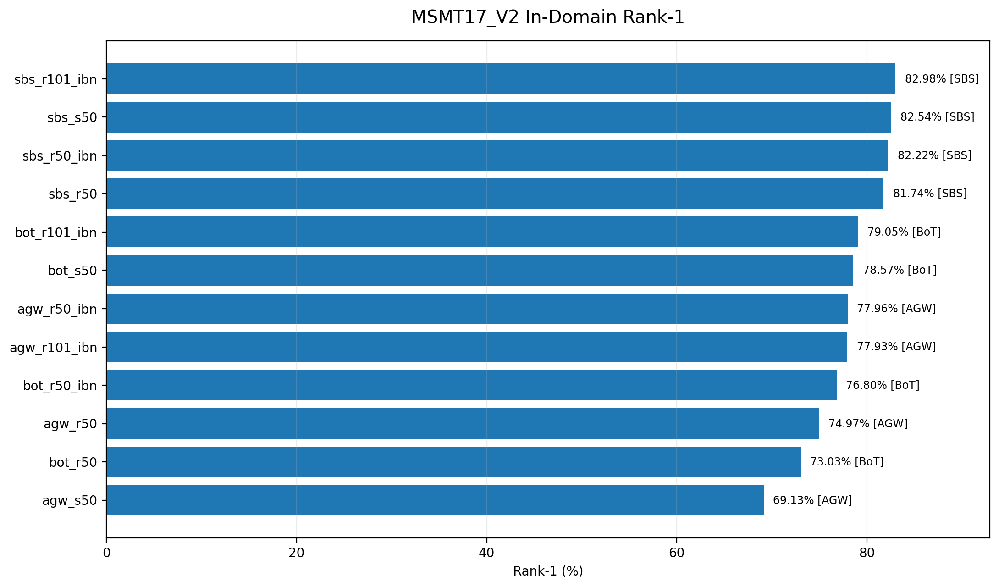
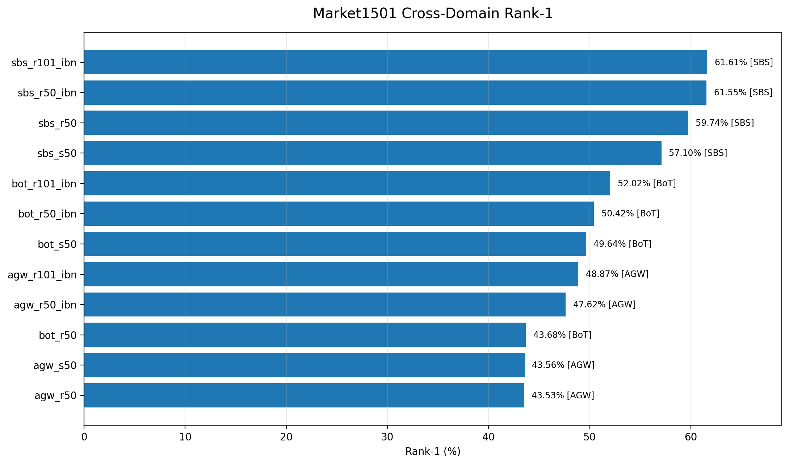
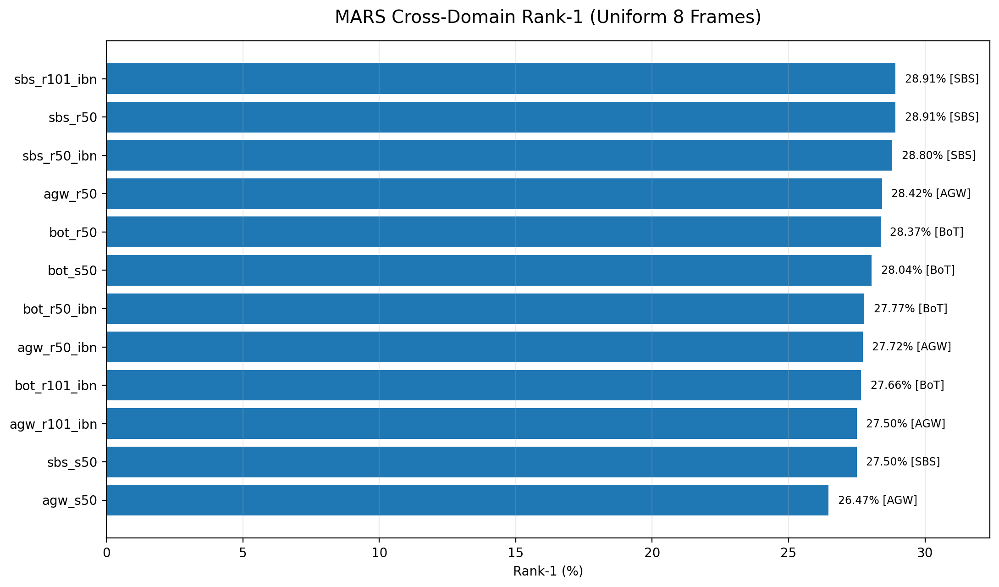
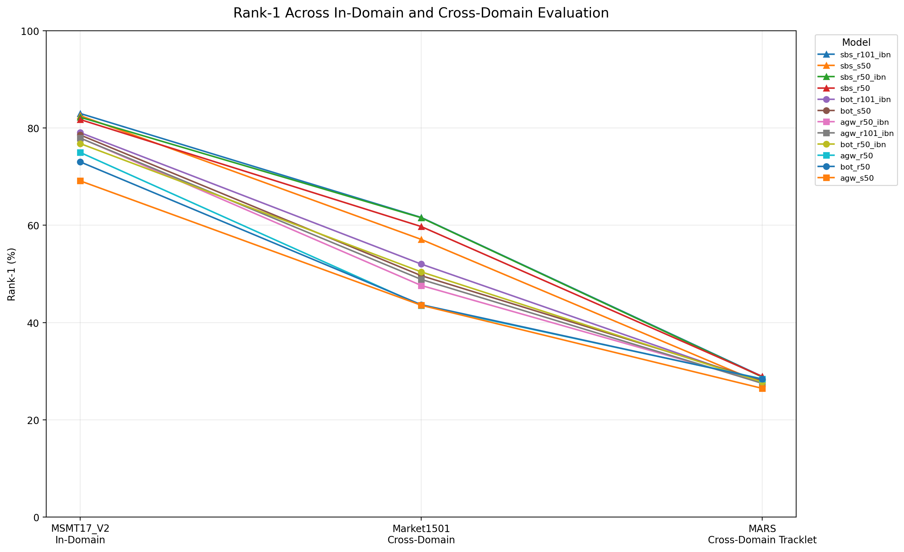
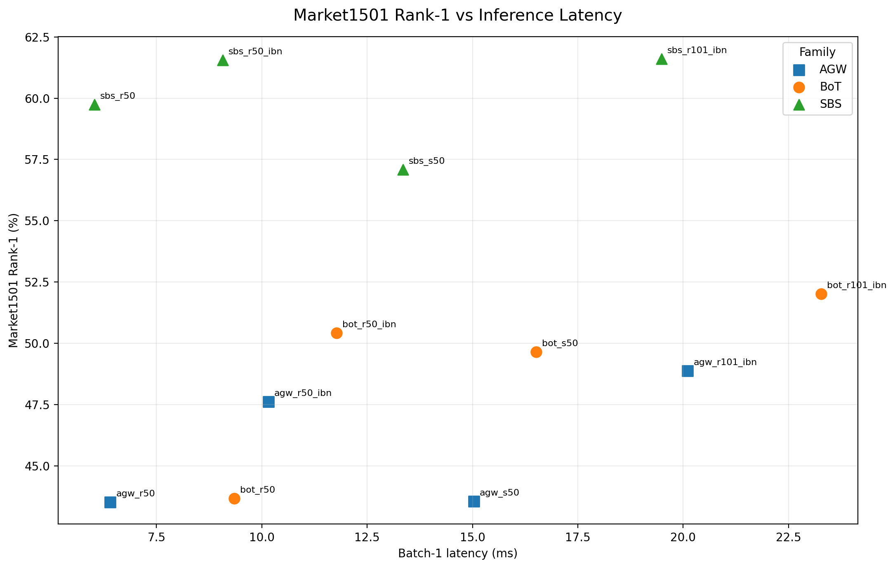

# SHAWAF Person Re-Identification Benchmark

A benchmarking framework for evaluating **Person Re-Identification (ReID)** models for the SHAWAF video-search system.

The project compares pretrained FastReID models across multiple datasets to study:

- ReID accuracy
- Cross-domain generalization
- Image-based vs tracklet-based retrieval
- Inference latency
- Throughput
- GPU memory usage
- Model complexity

The benchmark evaluates **12 FastReID models trained on MSMT17_V2**.

---

## Benchmark Overview

Three datasets are used:

| Dataset | Evaluation | Retrieval Unit |
|---|---|---|
| **MSMT17_V2** | In-Domain | Image |
| **Market1501** | Cross-Domain | Image |
| **MARS** | Cross-Domain | Tracklet |

Since all model checkpoints were trained on MSMT17_V2:

```text
MSMT17_V2
    |
    | In-Domain
    v
Model Performance

MSMT17_V2-trained model
    |
    +----> Market1501
    |      Cross-Domain Image ReID
    |
    +----> MARS
           Cross-Domain Tracklet ReID
```

This allows the benchmark to measure both performance inside the training domain and generalization to different ReID environments.

---

## Evaluated Models

Three FastReID recipe families are evaluated:

```text
BoT
AGW
SBS
```

Each family is tested with four backbone variants:

```text
R50
R50-IBN
S50
R101-IBN
```

Giving a total of:

```text
3 families x 4 backbones = 12 models
```

Model IDs:

```text
bot_r50
bot_r50_ibn
bot_s50
bot_r101_ibn

agw_r50
agw_r50_ibn
agw_s50
agw_r101_ibn

sbs_r50
sbs_r50_ibn
sbs_s50
sbs_r101_ibn
```

---

# Evaluation Protocol

## Image-Based ReID

Used for:

```text
MSMT17_V2
Market1501
```

Pipeline:

```text
Image
  |
  v
FastReID Encoder
  |
  v
2048-D Feature
  |
  v
L2 Normalization
  |
  v
Cosine Similarity
  |
  v
Gallery Ranking
  |
  v
Rank / mAP / mINP / CMC
```

Protocol name:

```text
single_image_l2
```

---

## Tracklet-Based ReID

MARS contains person tracklets instead of individual images.

The benchmark represents every tracklet using 8 uniformly sampled frames:

```text
Tracklet
   |
   v
Uniformly Sample 8 Frames
   |
   v
FastReID Encoder
   |
   v
Raw Frame Features
   |
   v
Mean Pooling
   |
   v
L2 Normalization
   |
   v
Tracklet Embedding
   |
   v
Cosine Retrieval
```

Protocol name:

```text
uniform8_mean_raw_l2
```

Frame features are kept raw before aggregation:

```text
Raw Frame Embeddings
        |
        v
      Mean
        |
        v
Final L2 Normalization
```

---

# Metrics

The benchmark evaluates retrieval quality using:

| Metric | Meaning |
|---|---|
| **Rank-1** | Correct identity appears as the first retrieval result |
| **Rank-5** | Correct identity appears within the first five results |
| **Rank-10** | Correct identity appears within the first ten results |
| **mAP** | Measures ranking quality across all correct matches |
| **mINP** | Measures how deep the last relevant positive appears |
| **CMC** | Matching performance across retrieval ranks |

Efficiency is measured using:

```text
Batch-1 Latency
Batch-16 Throughput
Tracklet Latency
Peak GPU Memory
Parameter Count
Checkpoint Size
```

---

# Final Benchmark Results

The completed benchmark contains:

```text
12 Models
x
3 Datasets
=
36 Accuracy Evaluations
```

## Accuracy and Efficiency Summary

| Model | MSMT R1 | MSMT mAP | Market R1 | Market mAP | MARS R1 | MARS mAP | Latency |
|---|---:|---:|---:|---:|---:|---:|---:|
| **sbs_r101_ibn** | 82.98% | 58.44% | 61.61% | 32.82% | 28.91% | 24.04% | 19.49 ms |
| **sbs_r50_ibn** | 82.22% | 56.49% | 61.55% | 32.05% | 28.80% | 24.04% | 9.07 ms |
| **sbs_r50** | 81.74% | 56.36% | 59.74% | 30.48% | 28.91% | 24.19% | 6.02 ms |
| **sbs_s50** | 82.54% | 59.27% | 57.10% | 29.19% | 27.50% | 23.66% | 13.35 ms |
| bot_r101_ibn | 79.05% | 55.68% | 52.02% | 26.49% | 27.66% | 23.42% | 23.28 ms |
| bot_r50_ibn | 76.80% | 52.59% | 50.42% | 26.22% | 27.77% | 23.48% | 11.77 ms |
| bot_s50 | 78.57% | 55.87% | 49.64% | 24.79% | 28.04% | 23.43% | 16.51 ms |
| agw_r101_ibn | 77.93% | 56.33% | 48.87% | 24.11% | 27.50% | 23.31% | 20.11 ms |
| agw_r50_ibn | 77.96% | 55.71% | 47.62% | 23.93% | 27.72% | 23.28% | 10.16 ms |
| bot_r50 | 73.03% | 48.00% | 43.68% | 20.96% | 28.37% | 23.29% | 9.34 ms |
| agw_s50 | 69.13% | 40.27% | 43.56% | 19.82% | 26.47% | 23.00% | 15.03 ms |
| agw_r50 | 74.97% | 51.54% | 43.53% | 21.61% | 28.42% | 23.25% | 6.40 ms |

Complete benchmark data is available in:

```text
benchmarks/results/final_benchmark_summary.csv
```

---

# Benchmark Visualizations

## MSMT17_V2 In-Domain Performance

The MSMT17_V2 benchmark measures model performance inside the same domain used to train the checkpoints.



SBS models produce the strongest Rank-1 results, with the R101-IBN variant reaching the highest Rank-1 score.

---

## Market1501 Cross-Domain Performance

Market1501 measures how well the MSMT17-trained models generalize to a different image-based ReID dataset.



The difference between model families becomes clear here, with SBS maintaining significantly stronger cross-domain performance.

---

## MARS Tracklet Performance

MARS changes both the domain and the retrieval unit.

Instead of retrieving single images, every person is represented by a multi-frame tracklet.



The model results become much more compressed compared with MSMT17 and Market1501.

Most models fall within a narrow Rank-1 range of approximately:

```text
26.5% - 28.9%
```

---

# Domain Generalization

The following visualization compares Rank-1 performance across all three evaluation settings:



A clear performance reduction appears when moving from:

```text
MSMT17_V2
    |
    v
Market1501
    |
    v
MARS
```

The MSMT17 to Market1501 change mainly reflects **cross-domain generalization**.

The transition to MARS also introduces a change from:

```text
Single-Image ReID
        |
        v
Tracklet-Based ReID
```

so the MARS reduction should not be interpreted as domain shift alone.

---

# Accuracy vs Efficiency

Accuracy alone is not enough for deployment.

The ReID encoder will eventually process large numbers of person detections, so inference cost is also important.



The benchmark shows that deeper models can provide better accuracy, but the improvement may come with significantly higher inference latency and model complexity.

For example:

```text
SBS-R101-IBN

Market Rank-1 : 61.61%
MARS Rank-1   : 28.91%
Latency       : 19.49 ms
Parameters    : 42.58M
```

while:

```text
SBS-R50

Market Rank-1 : 59.74%
MARS Rank-1   : 28.91%
Latency       : 6.02 ms
Parameters    : 23.54M
```

This difference is important when choosing models for large-scale CCTV processing.

---

# Main Findings

## SBS provides the strongest image-based performance

The SBS family produces the strongest results on both:

```text
MSMT17_V2
Market1501
```

The top Market1501 Rank-1 scores are all produced by SBS models.

---

## Cross-domain ReID remains difficult

Performance drops considerably when models trained on MSMT17_V2 are evaluated directly on Market1501.

For example:

```text
SBS-R101-IBN

MSMT17 Rank-1
82.98%

Market1501 Rank-1
61.61%
```

This demonstrates the importance of domain generalization in Person Re-Identification.

---

## MARS behaves differently from the image datasets

Market1501 Rank-1 spans approximately:

```text
43.5% - 61.6%
```

while MARS Rank-1 spans only approximately:

```text
26.5% - 28.9%
```

The difference between model architectures becomes much smaller under the current tracklet representation.

This indicates that the tracklet pipeline itself has a large influence on video-based ReID performance.

---

# Baseline Model

For controlled experiments inside this benchmark, **SBS-R50** provides a strong balance between accuracy and computational cost.

Its measured performance is:

```text
MSMT17_V2
Rank-1 : 81.74%
mAP    : 56.36%

Market1501
Rank-1 : 59.74%
mAP    : 30.48%

MARS
Rank-1 : 28.91%
mAP    : 24.19%
```

Efficiency:

```text
Batch-1 Latency
6.02 ms

Throughput
244.15 images/s

Peak VRAM — Batch 16
278.66 MB

Parameters
23.54M
```

This provides strong image-based performance while remaining substantially lighter than SBS-R101-IBN.

---

# Embedding Cache

Model inference and metric evaluation are separated.

Generated embeddings are stored under:

```text
benchmarks/
└── embeddings/
    └── <model_id>/
        └── <dataset>/
            └── <protocol>/
                ├── query.npz
                └── gallery.npz
```

This allows metrics, CMC curves, summaries, and visualizations to be regenerated without running the neural network again.

Example:

```text
benchmarks/embeddings/sbs_r50/

├── msmt17/
│   └── single_image_l2/
│
├── market1501/
│   └── single_image_l2/
│
└── mars/
    └── uniform8_mean_raw_l2/
```

---

# Project Structure

```text
Shawaf-FastReID-MSMT17-Benchmark/
│
├── configs/
│   └── benchmark/
│       └── fastreid_msmt17_models.yaml
│
├── reid/
│   ├── benchmark/
│   ├── data/
│   ├── embeddings/
│   ├── evaluation/
│   ├── models/
│   └── profiling/
│
├── scripts/
│   ├── build_embedding_cache.py
│   ├── evaluate_embedding_cache.py
│   ├── run_cross_domain_benchmark.py
│   ├── summarize_benchmark_results.py
│   ├── profile_fastreid_models.py
│   ├── build_final_benchmark_summary.py
│   ├── generate_benchmark_figures.py
│   └── generate_cmc_curves.py
│
├── benchmarks/
│   ├── embeddings/
│   ├── results/
│   └── figures/
│
├── checkpoints/
├── data/
│
└── third_party/
    └── fast-reid/
```

Large runtime assets such as:

```text
datasets
checkpoints
embedding caches
virtual environments
third-party repositories
```

are excluded from Git where appropriate.

---

# Running the Benchmark

Install the local project:

```bash
python -m pip install -e .
```

Validate the model registry:

```bash
python scripts/validate_model_registry.py
```

Validate the datasets:

```bash
python scripts/test_msmt17_loader.py
python scripts/test_market1501_loader.py
python scripts/test_mars_loader.py
```

Run all benchmark evaluations:

```bash
python scripts/run_cross_domain_benchmark.py
```

Run a specific dataset:

```bash
python scripts/run_cross_domain_benchmark.py --datasets msmt17
```

Run a specific model:

```bash
python scripts/run_cross_domain_benchmark.py --models sbs_r50
```

Run one model on one dataset:

```bash
python scripts/run_cross_domain_benchmark.py --models sbs_r50 --datasets mars
```

---

# Generate Reports

Generate the accuracy summary:

```bash
python scripts/summarize_benchmark_results.py
```

Generate the final accuracy and efficiency summary:

```bash
python scripts/build_final_benchmark_summary.py
```

Generate benchmark figures:

```bash
python scripts/generate_benchmark_figures.py
```

Generate CMC data and figures:

```bash
python scripts/generate_cmc_curves.py
```

---

# Output

Main benchmark results:

```text
benchmarks/results/
├── cross_domain_summary.csv
├── cross_domain_summary.md
├── fastreid_efficiency.csv
├── final_benchmark_summary.csv
├── final_benchmark_summary.md
│
├── <model_id>/
│   ├── msmt17/
│   ├── market1501/
│   └── mars/
│
└── cmc/
```

Visualizations are stored in:

```text
benchmarks/figures/
```

Embedding caches are stored in:

```text
benchmarks/embeddings/
```

---

# Benchmark Status

```text
FastReID Models          12

Evaluation Datasets      3

Accuracy Evaluations     36

MSMT17_V2                In-Domain
Market1501               Cross-Domain
MARS                     Cross-Domain Tracklet

Accuracy Metrics         Rank / mAP / mINP / CMC

Efficiency Metrics       Latency / Throughput / VRAM / Parameters

Benchmark Reports        Generated

Visualization Reports    Generated
```

---

# About SHAWAF

This repository contains the benchmarking layer for the appearance-based Person Re-Identification component of **SHAWAF**.

The broader system combines ReID with:

```text
Person Detection
Tracking
Tracklet Construction
Semantic Understanding
Vector Retrieval
Metadata Filtering
Re-Ranking
Video Search
```

This benchmark provides a controlled environment for measuring the behavior, generalization, and computational cost of different ReID encoders before they are integrated into the larger system.