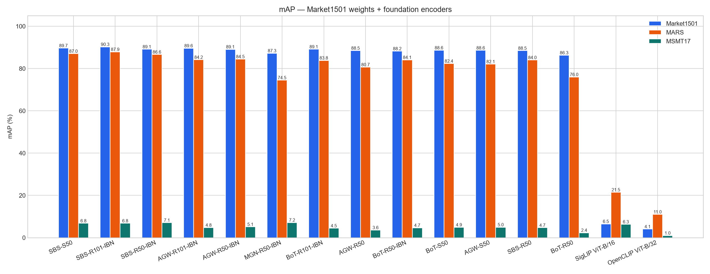
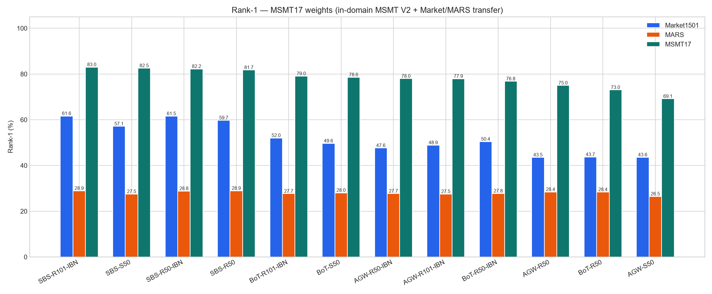
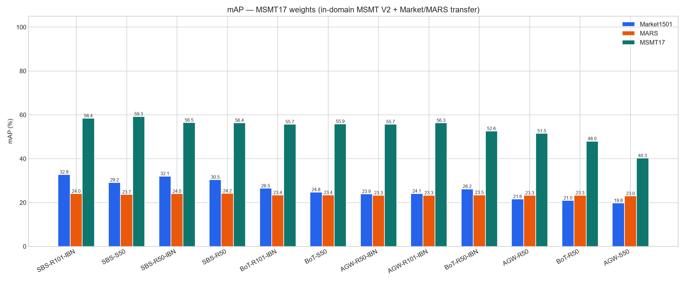
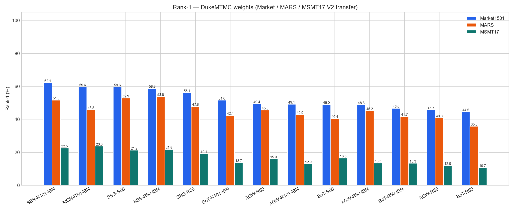
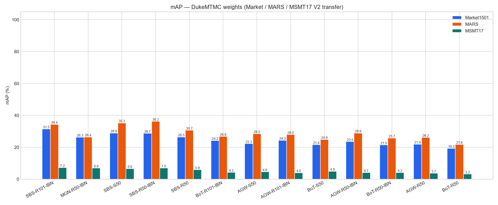
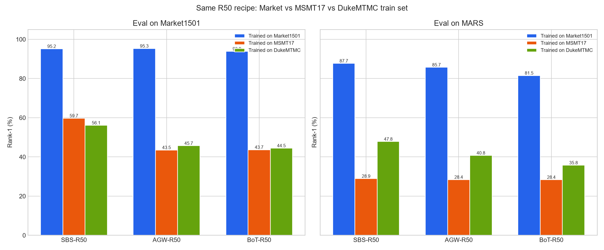
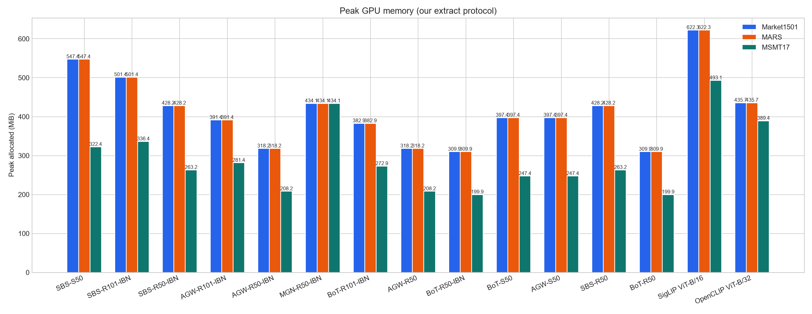

# Benchmark tables and graphs

Frozen encoders, cosine on L2 features, same-pid + same-camera junk.
Market-trained MSMT is **V1**. MSMT-trained and Duke-trained MSMT is **V2**.
Duke images are not evaluated (dataset withdrawn).

- [Market-trained](#market-trained)
- [MSMT-trained](#msmt-trained)
- [Duke-trained](#duke-trained)
- [Same recipe, three train sets](#same-recipe-three-train-sets)
- [Compute](#compute)

## Market-trained

| Model | Train | Market R1 | Market mAP | Market mINP | MARS R1 | MARS mAP | MARS mINP | MSMT R1 | MSMT mAP | MSMT mINP |
|---|---|---:|---:|---:|---:|---:|---:|---:|---:|---:|
| SBS-S50 | Market1501 | 96.11 | 89.67 | 68.75 | 90.54 | 87.03 | 70.41 | 19.70 | 6.80 | 0.25 |
| SBS-R101-IBN | Market1501 | 95.81 | 90.25 | 71.28 | 90.33 | 87.88 | 71.65 | 19.78 | 6.81 | 0.25 |
| SBS-R50-IBN | Market1501 | 95.55 | 89.13 | 67.26 | 89.18 | 86.64 | 70.10 | 20.79 | 7.10 | 0.28 |
| AGW-R101-IBN | Market1501 | 95.52 | 89.61 | 69.36 | 87.55 | 84.15 | 66.52 | 14.20 | 4.78 | 0.20 |
| AGW-R50-IBN | Market1501 | 95.52 | 89.09 | 67.93 | 87.55 | 84.47 | 67.57 | 14.52 | 5.14 | 0.26 |
| MGN-R50-IBN | Market1501 | 95.37 | 87.25 | 56.47 | 84.51 | 74.50 | 43.81 | 20.84 | 7.17 | 0.24 |
| BoT-R101-IBN | Market1501 | 95.34 | 89.12 | 68.23 | 86.79 | 83.83 | 65.82 | 13.29 | 4.47 | 0.17 |
| AGW-R50 | Market1501 | 95.31 | 88.49 | 65.90 | 85.71 | 80.67 | 60.50 | 10.84 | 3.61 | 0.17 |
| BoT-R50-IBN | Market1501 | 95.28 | 88.23 | 65.44 | 87.83 | 84.10 | 66.38 | 13.23 | 4.69 | 0.19 |
| BoT-S50 | Market1501 | 95.28 | 88.64 | 66.83 | 86.14 | 82.35 | 63.21 | 14.36 | 4.92 | 0.17 |
| AGW-S50 | Market1501 | 95.19 | 88.59 | 66.67 | 86.47 | 82.09 | 63.54 | 14.86 | 4.96 | 0.20 |
| SBS-R50 | Market1501 | 95.16 | 88.46 | 65.46 | 87.72 | 84.04 | 64.51 | 14.73 | 4.72 | 0.14 |
| BoT-R50 | Market1501 | 93.85 | 86.30 | 60.61 | 81.52 | 75.99 | 54.26 | 7.47 | 2.35 | 0.12 |
| SigLIP ViT-B/16 | WebLI | 20.58 | 6.51 | 0.35 | 38.97 | 21.49 | 6.29 | 24.40 | 6.33 | 0.12 |
| OpenCLIP ViT-B/32 | LAION-2B | 13.15 | 4.06 | 0.25 | 21.52 | 11.03 | 2.67 | 4.74 | 1.02 | 0.05 |

## MSMT-trained

| Model | Train | Market R1 | Market mAP | Market mINP | MARS R1 | MARS mAP | MARS mINP | MSMT R1 | MSMT mAP | MSMT mINP |
|---|---|---:|---:|---:|---:|---:|---:|---:|---:|---:|
| SBS-R101-IBN | MSMT17 | 61.61 | 32.82 | 5.04 | 28.91 | 24.04 | 14.88 | 82.98 | 58.44 | 11.86 |
| SBS-R50-IBN | MSMT17 | 61.55 | 32.05 | 5.13 | 28.80 | 24.04 | 14.76 | 82.22 | 56.49 | 10.42 |
| SBS-R50 | MSMT17 | 59.74 | 30.48 | 4.59 | 28.91 | 24.19 | 14.93 | 81.74 | 56.36 | 10.13 |
| SBS-S50 | MSMT17 | 57.10 | 29.19 | 3.87 | 27.50 | 23.66 | 14.84 | 82.54 | 59.27 | 12.93 |
| BoT-R101-IBN | MSMT17 | 52.02 | 26.49 | 4.63 | 27.66 | 23.42 | 14.25 | 79.05 | 55.68 | 13.63 |
| BoT-R50-IBN | MSMT17 | 50.42 | 26.22 | 4.42 | 27.77 | 23.48 | 14.29 | 76.80 | 52.59 | 11.59 |
| BoT-S50 | MSMT17 | 49.64 | 24.79 | 3.38 | 28.04 | 23.43 | 14.08 | 78.57 | 55.87 | 13.90 |
| AGW-R101-IBN | MSMT17 | 48.87 | 24.11 | 4.19 | 27.50 | 23.31 | 14.11 | 77.93 | 56.33 | 15.62 |
| AGW-R50-IBN | MSMT17 | 47.62 | 23.93 | 3.87 | 27.72 | 23.28 | 14.03 | 77.96 | 55.71 | 14.33 |
| BoT-R50 | MSMT17 | 43.68 | 20.96 | 3.20 | 28.37 | 23.29 | 13.90 | 73.03 | 48.00 | 9.67 |
| AGW-S50 | MSMT17 | 43.56 | 19.82 | 2.28 | 26.47 | 23.00 | 13.81 | 69.13 | 40.27 | 4.86 |
| AGW-R50 | MSMT17 | 43.53 | 21.61 | 3.49 | 28.42 | 23.25 | 13.95 | 74.97 | 51.54 | 12.12 |

## Duke-trained

| Model | Train | Market R1 | Market mAP | Market mINP | MARS R1 | MARS mAP | MARS mINP | MSMT R1 | MSMT mAP | MSMT mINP |
|---|---|---:|---:|---:|---:|---:|---:|---:|---:|---:|
| SBS-R101-IBN | DukeMTMC | 62.14 | 31.48 | 3.38 | 51.63 | 34.36 | 11.63 | 22.54 | 7.22 | 0.18 |
| MGN-R50-IBN | DukeMTMC | 59.65 | 26.31 | 1.76 | 45.82 | 26.44 | 7.91 | 23.64 | 6.95 | 0.10 |
| SBS-S50 | DukeMTMC | 59.62 | 28.94 | 2.94 | 52.88 | 35.28 | 12.06 | 21.23 | 6.63 | 0.16 |
| SBS-R50-IBN | DukeMTMC | 58.76 | 28.71 | 3.24 | 53.80 | 36.25 | 13.00 | 21.78 | 6.98 | 0.16 |
| SBS-R50 | DukeMTMC | 56.12 | 26.47 | 2.51 | 47.83 | 30.67 | 10.09 | 19.09 | 5.90 | 0.12 |
| BoT-R101-IBN | DukeMTMC | 51.57 | 24.24 | 2.89 | 42.39 | 26.79 | 8.54 | 13.71 | 4.22 | 0.11 |
| AGW-S50 | DukeMTMC | 49.38 | 22.25 | 2.24 | 45.54 | 28.54 | 9.42 | 15.93 | 4.63 | 0.13 |
| AGW-R101-IBN | DukeMTMC | 49.11 | 24.31 | 3.40 | 42.88 | 27.95 | 9.07 | 12.93 | 4.03 | 0.13 |
| BoT-S50 | DukeMTMC | 48.96 | 21.58 | 2.17 | 40.43 | 24.86 | 8.03 | 16.49 | 4.95 | 0.14 |
| AGW-R50-IBN | DukeMTMC | 48.81 | 23.52 | 2.95 | 45.16 | 28.92 | 9.58 | 13.48 | 4.10 | 0.13 |
| BoT-R50-IBN | DukeMTMC | 46.62 | 21.47 | 2.58 | 41.74 | 25.73 | 8.14 | 13.35 | 4.15 | 0.12 |
| AGW-R50 | DukeMTMC | 45.69 | 21.91 | 2.89 | 40.76 | 26.17 | 8.62 | 11.97 | 3.74 | 0.13 |
| BoT-R50 | DukeMTMC | 44.48 | 19.29 | 1.96 | 35.76 | 21.79 | 6.83 | 10.71 | 3.17 | 0.12 |

## Same recipe, three train sets

SBS / AGW / BoT R50 trained on Market vs MSMT vs Duke.

## Compute

Our CUDA-event protocol on Market1501 extract (RTX 5070 Laptop).
Imported Duke/MSMT efficiency is Tesla T4 and is not in this table.

| Model | Params (M) | Weights (MiB) | Allocated (MiB) | Peak (MiB) | GPU ms/img | GPU img/s |
|---|---:|---:|---:|---:|---:|---:|
| BoT-R50 | 23.5 | 89.9 | 89.9 | 309.9 | 1.50 | 665.8 |
| AGW-R50 | 23.5 | 90.0 | 90.1 | 318.2 | 1.54 | 650.9 |
| BoT-R50-IBN | 23.5 | 89.9 | 90.0 | 309.9 | 1.58 | 632.4 |
| OpenCLIP ViT-B/32 | 87.5 | 333.6 | 333.6 | 435.7 | 1.71 | 584.1 |
| AGW-R50-IBN | 23.5 | 90.0 | 90.1 | 318.2 | 1.73 | 576.4 |
| BoT-S50 | 25.4 | 97.3 | 97.3 | 397.4 | 2.14 | 467.7 |
| AGW-S50 | 25.4 | 97.3 | 97.3 | 397.4 | 2.16 | 463.2 |
| AGW-R101-IBN | 42.6 | 162.9 | 163.2 | 391.4 | 2.39 | 417.6 |
| BoT-R101-IBN | 42.5 | 162.5 | 162.8 | 382.9 | 2.40 | 416.6 |
| SBS-R50 | 23.5 | 90.0 | 90.1 | 428.2 | 2.54 | 394.2 |
| SBS-R50-IBN | 23.5 | 90.0 | 90.1 | 428.2 | 2.92 | 342.8 |
| SBS-R101-IBN | 42.6 | 162.9 | 163.2 | 501.4 | 3.69 | 270.9 |
| MGN-R50-IBN | 68.8 | 263.0 | 268.1 | 434.1 | 4.67 | 214.2 |
| SBS-S50 | 25.4 | 97.3 | 97.4 | 547.4 | 5.69 | 175.7 |
| SigLIP ViT-B/16 | 92.9 | 354.3 | 354.3 | 622.3 | 6.84 | 146.2 |
